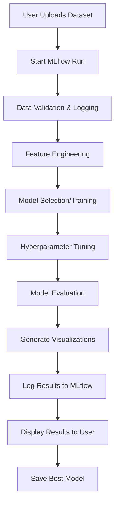

# MLflow Integration Guide

## 🚀 **Complete MLflow Integration for Your Quantile Analysis Platform**

This guide explains how to implement and use MLflow for experiment tracking, hyperparameter tuning, and model management in your modular dashboard-driven analysis platform.

---

## 📋 **Table of Contents**

1. [What is MLflow and Why Use It?](#what-is-mlflow)
2. [MLflow vs Airflow Dashboards](#mlflow-vs-airflow)
3. [Modular Architecture](#modular-architecture)
4. [Setup and Installation](#setup-installation)
5. [Basic Usage](#basic-usage)
6. [Hyperparameter Tuning](#hyperparameter-tuning)
7. [Dashboard Integration](#dashboard-integration)
8. [Advanced Features](#advanced-features)

---

## 🎯 **What is MLflow and Why Use It?**

### **MLflow Core Components:**
- **Tracking**: Log parameters, metrics, artifacts, and models
- **Projects**: Package code in reusable format
- **Models**: Deploy models to various platforms
- **Model Registry**: Centralized model store with versioning

### **Perfect for Your Platform Because:**
- **User Upload Workflow**: Track every analysis run with different datasets
- **Experiment Comparison**: Compare model performance across different uploads
- **Model Versioning**: Keep track of best models for different data types
- **Automated Reporting**: Generate reports from tracked experiments
- **Hyperparameter Optimization**: Automatically find best model settings

---

## 🔄 **MLflow vs Airflow Dashboards**

### **MLflow Dashboard** (What You Need)
```bash
# Start MLflow UI
mlflow ui --host 0.0.0.0 --port 5000
```

**Purpose**: Experiment tracking and model management  
**Features**:
- View experiment results and metrics
- Compare multiple runs side-by-side
- Download models and artifacts
- Track model performance over time
- Search and filter experiments

**Perfect for your use case** because users can:
- Upload dataset → See tracked experiment
- Compare analyses on different datasets
- Download best performing models
- View automated reports and visualizations

### **Airflow Dashboard** (Different Purpose)
**Purpose**: Workflow orchestration (scheduling, dependencies)  
**Not needed for your use case** unless you want:
- Scheduled daily/weekly model retraining
- Complex multi-step data pipelines
- Dependency management between tasks

### **Your Final Dashboard** (Custom User Interface)
Your custom web interface for:
- File upload (Excel/CSV)
- Analysis selection
- Results display
- **Integrates with MLflow** for tracking and model serving

---

## 🏗️ **Modular Architecture**

### **Current Integration Structure:**

```
models/quantile_analysis/
├── config/
│   ├── mlflow_config.yaml        # ✅ MLflow configuration
│   ├── data_config.yaml          # Existing
│   └── experiment_config.yaml    # Existing
│
├── src/
│   ├── tracking/                 # ✅ NEW MLflow modules
│   │   ├── mlflow_client.py      # Core MLflow interface
│   │   ├── experiment_tracker.py # Integration layer
│   │   └── hyperopt_runner.py    # Hyperparameter tuning
│   │
│   ├── model_trainer.py          # Enhanced with tracking
│   ├── evaluator.py              # Enhanced with tracking
│   └── [existing modules]
│
└── experiments/
    └── run_experiment.py         # Enhanced with MLflow
```

### **Key Benefits:**
- **Modular**: MLflow is optional - system works without it
- **Non-invasive**: Existing experiments still work unchanged
- **Extensible**: Easy to add new tracking features
- **Configurable**: Enable/disable tracking via configuration

---

## 🛠️ **Setup and Installation**

### **1. Install Dependencies**
```bash
pip install mlflow optuna matplotlib plotly
```

### **2. Configure MLflow**
Edit `config/mlflow_config.yaml`:

```yaml
mlflow:
  tracking_uri: "sqlite:///mlflow.db"  # Local development
  # tracking_uri: "http://mlflow-server:5000"  # Production server
  experiment_name: "quantile_analysis"
  
  auto_log:
    lightgbm: true
    xgboost: true
    sklearn: true
```

### **3. Start MLflow UI**
```bash
# In your project directory
mlflow ui --backend-store-uri sqlite:///mlflow.db --host 0.0.0.0 --port 5000
```

Access at: http://localhost:5000

### **4. Test Integration**
```bash
# Run experiment with tracking
python experiments/run_experiment.py -e nav_baseline --config_dir config
```

---

## 🎯 **Basic Usage**

### **Automatic Tracking (Zero Code Changes)**
Your existing experiments now automatically track:
- **Parameters**: Model type, features, transformations
- **Metrics**: Pinball loss, coverage analysis, performance by strategy
- **Artifacts**: Model files, configuration files, plots
- **Data Quality**: Row counts, missing values, duplicates

### **Manual Integration Example**
```python
from src.tracking import ExperimentTracker

# Initialize tracker
tracker = ExperimentTracker()

# Start experiment
tracker.start_experiment("custom_analysis", {
    "model_type": "xgboost",
    "target": "nav_log",
    "user_dataset": "uploaded_file.xlsx"
})

# Log custom metrics
tracker.log_data_stage(df, "uploaded", {"file_size": len(df)})
tracker.log_transformations(transformation_manager)
tracker.log_training_results(training_results)
tracker.log_evaluation_results(evaluation_results)

# End experiment
tracker.end_experiment(success=True)
```

---

## 🔧 **Hyperparameter Tuning with MLflow**

### **How MLflow Conducts Hyperparameter Tuning:**

1. **Optuna Integration**: Uses Optuna for smart parameter search
2. **Tree-structured Parzen Estimator (TPE)**: Bayesian optimization algorithm
3. **Automatic Tracking**: Every trial logged as separate MLflow run
4. **Visualization**: Optimization history and parameter importance plots

### **Usage Example:**
```python
from src.tracking import HyperoptRunner, MLflowClient

# Initialize components
mlflow_client = MLflowClient()
hyperopt_runner = HyperoptRunner(mlflow_client)

# Define training and evaluation functions
def train_model(data_dict, model_params):
    # Your training code with custom parameters
    pass

def evaluate_model(training_results, data_dict):
    # Your evaluation code
    pass

# Run hyperparameter optimization
study = hyperopt_runner.run_optimization(
    train_func=train_model,
    evaluate_func=evaluate_model,
    model_type="xgboost",
    data_dict=your_data,
    target_metric="test_pinball_loss_avg"
)

# Get best parameters
best_params = hyperopt_runner.get_best_params(study)
print(f"Best parameters: {best_params}")
```

### **What Gets Tracked:**
- **Every Trial**: 50+ trials with different parameter combinations
- **Optimization History**: How performance improves over trials
- **Parameter Importance**: Which parameters matter most
- **Best Model**: Automatically identified and saved
- **Convergence Plots**: Visual optimization progress

### **Hyperparameter Search Spaces:**

**XGBoost:**
- `max_depth`: 3-15
- `learning_rate`: 0.01-0.3
- `subsample`: 0.5-1.0
- `colsample_bytree`: 0.5-1.0
- `n_estimators`: 50-500

**LightGBM:**
- `num_leaves`: 10-100
- `learning_rate`: 0.01-0.3
- `feature_fraction`: 0.5-1.0
- `bagging_fraction`: 0.5-1.0
- `num_boost_round`: 50-500

---

## 🖥️ **Dashboard Integration for Your Upload Platform**

### **User Workflow with MLflow Integration:**



### **Frontend Integration Example:**
```python
from flask import Flask, request, jsonify
from src.tracking import ExperimentTracker
import pandas as pd

app = Flask(__name__)

@app.route('/analyze', methods=['POST'])
def analyze_dataset():
    # Get uploaded file
    file = request.files['dataset']
    analysis_type = request.form['analysis_type']
    
    # Load data
    df = pd.read_excel(file) if file.filename.endswith('.xlsx') else pd.read_csv(file)
    
    # Initialize tracking
    tracker = ExperimentTracker()
    experiment_config = {
        "model_type": request.form.get('model_type', 'lightgbm'),
        "target": request.form.get('target_column'),
        "file_name": file.filename,
        "analysis_type": analysis_type
    }
    
    try:
        # Start tracking
        tracker.start_experiment(f"user_upload_{analysis_type}", experiment_config)
        tracker.log_data_stage(df, "uploaded", {"file_name": file.filename})
        
        # Run analysis (your existing code)
        results = run_quantile_analysis(df, experiment_config)
        
        # Log results
        tracker.log_evaluation_results(results)
        tracker.end_experiment(success=True)
        
        # Return results with MLflow run info
        return jsonify({
            "success": True,
            "results": results,
            "mlflow_run": tracker.get_run_info(),
            "dashboard_url": "http://localhost:5000"
        })
        
    except Exception as e:
        tracker.log_error(e, "analysis")
        tracker.end_experiment(success=False)
        return jsonify({"success": False, "error": str(e)})
```

### **Dashboard Features for Users:**

1. **Real-time Tracking**: See experiment progress in MLflow UI
2. **Results Comparison**: Compare analyses across different uploads
3. **Model Download**: Download best performing models
4. **Report Generation**: Automated reports with tracked metrics
5. **History**: View all previous analyses

---

## 🚀 **Advanced Features**

### **1. Model Registry for Production**
```python
# Register best model
model_version = mlflow_client.register_model(
    model_uri=f"runs:/{run_id}/models",
    model_name="quantile_analysis_production"
)

# Promote to production
mlflow_client.transition_model_version_stage(
    name="quantile_analysis_production",
    version=model_version.version,
    stage="Production"
)
```

### **2. Automated Model Serving**
```python
# Serve model via REST API
mlflow models serve -m models:/quantile_analysis_production/Production -p 8080
```

### **3. Experiment Comparison API**
```python
# Compare multiple experiments
best_runs = mlflow_client.search_runs(
    filter_string="metrics.test_pinball_loss_avg < 5000000"
)

# Generate comparison report
comparison_report = create_comparison_report(best_runs)
```

### **4. Automated Retraining Pipeline**
```python
# Schedule automated retraining when new data arrives
def retrain_pipeline():
    # Load new data
    # Run hyperparameter optimization
    # Compare with existing models
    # Deploy if better
    pass
```

---

## 📊 **MLflow Dashboard Usefulness in Your Context**

### **🔴 Extremely Useful For:**

1. **Multi-User Platform**: Track analyses from different users
2. **Dataset Comparison**: Compare model performance across datasets
3. **Model Management**: Version control for best models
4. **Automated Reporting**: Generate insights from tracked experiments
5. **Performance Monitoring**: Track model drift over time
6. **Hyperparameter History**: Learn what works for different data types

### **🟡 Moderately Useful For:**

1. **Development**: Great for model development and testing
2. **Debugging**: Track failed experiments and errors
3. **Collaboration**: Share results across team members

### **🟢 Nice-to-Have For:**

1. **Deployment**: Model serving capabilities
2. **CI/CD**: Integration with automated testing

---

## 🎯 **Quick Start Commands**

```bash
# 1. Install dependencies
pip install mlflow optuna matplotlib

# 2. Start MLflow UI
mlflow ui --backend-store-uri sqlite:///mlflow.db --port 5000

# 3. Run experiment with tracking
python experiments/run_experiment.py -e nav_baseline --config_dir config

# 4. Run hyperparameter optimization
python experiments/run_hyperopt.py --model_type xgboost --target nav_log

# 5. View results
# Open http://localhost:5000 in browser
```

---

## 🏁 **Summary**

**MLflow transforms your platform from basic analysis to production-ready ML system:**

- ✅ **Track every user upload and analysis**
- ✅ **Automatically optimize model parameters**
- ✅ **Compare performance across different datasets**
- ✅ **Version control your best models**
- ✅ **Generate automated insights and reports**
- ✅ **Scale to handle multiple users and datasets**
- ✅ **Maintain full experiment reproducibility**

**The modular design means you get all these benefits while keeping your existing code working exactly as before!** 